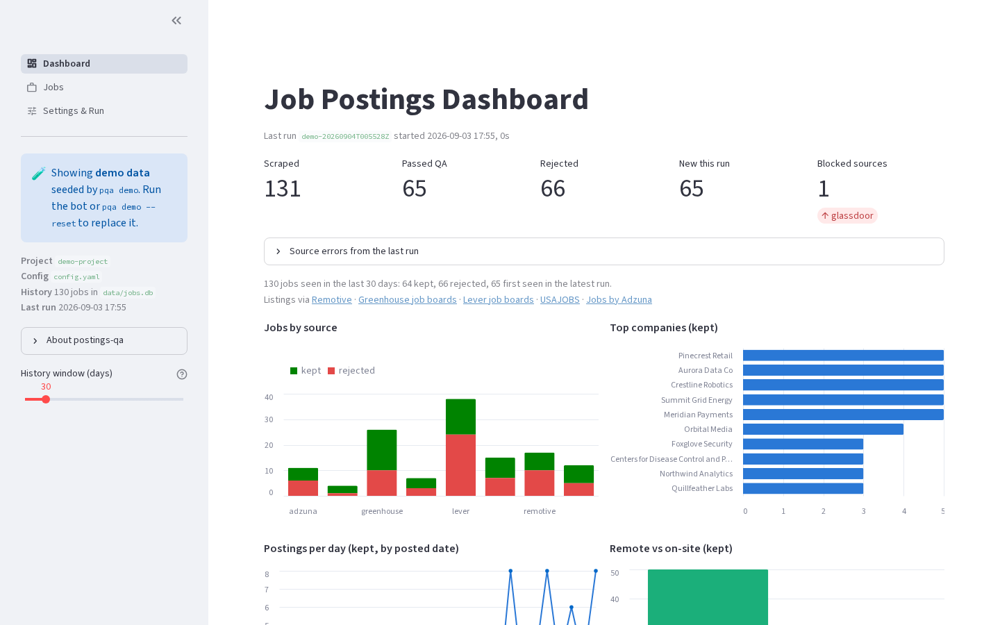
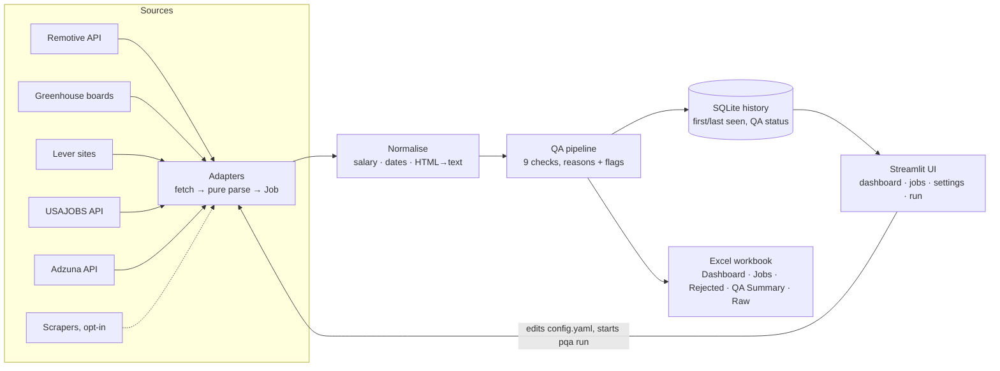
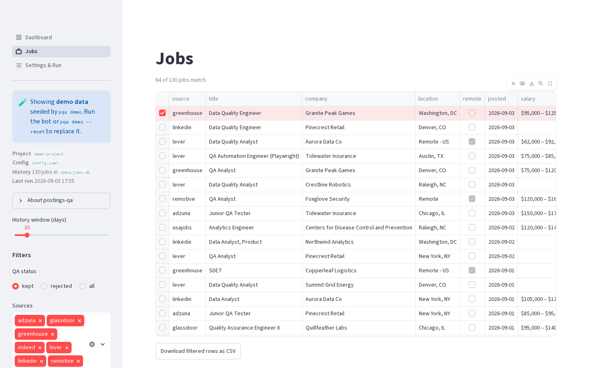
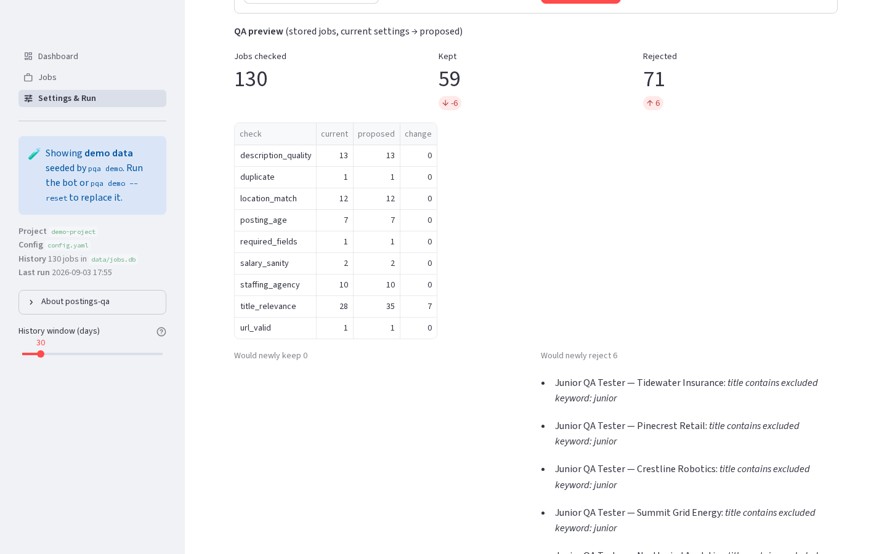
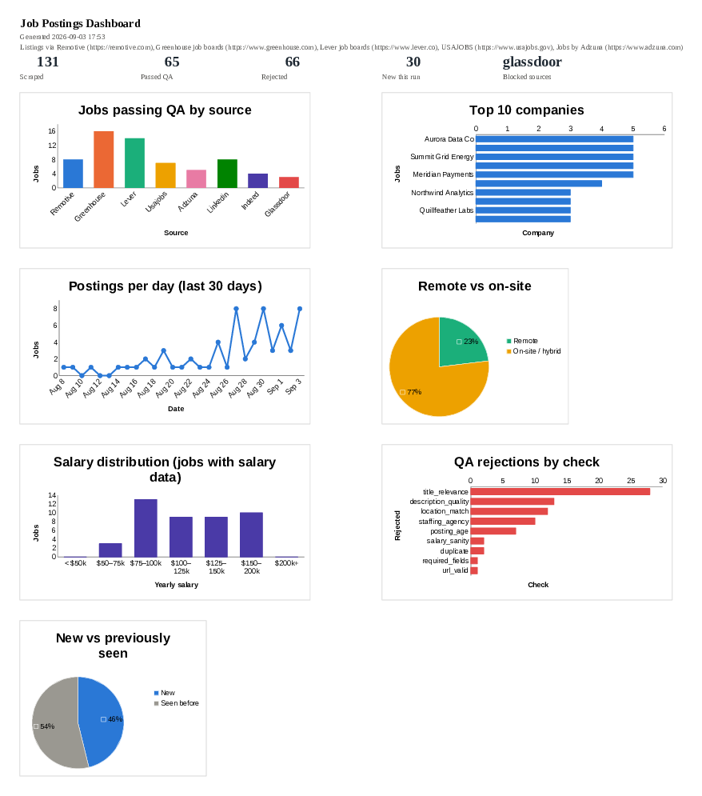

# postings-qa

**A job-postings pipeline with a data-QA core.** It pulls listings from public job APIs, runs rule-based
quality checks that reject bad rows *with a stated reason*, keeps a deduplicated history in SQLite, and
turns the result into an Excel workbook with charts and a Streamlit dashboard where you can tune the
filters and start runs.

  



## What this demonstrates

- **Rule-based data QA that is auditable.** Nine checks (duplicates, required fields, URL host vs source,
  title relevance, staffing agencies, location, posting age, salary sanity, description quality). Every
  rejected listing carries the check names and the reason text, so a filter decision can be inspected,
  not just trusted.
- **Deduplication across runs.** Stable ids per source, first-seen / last-seen timestamps, and "new this
  run" derived from them rather than re-guessed.
- **Normalisation before validation.** Free-text salaries become min / max / currency / period and are
  annualised for range checks; relative dates ("3 days ago", epoch ms, ISO with offsets) become dates;
  HTML descriptions become text.
- **Pluggable sources with pure parsers.** Each adapter separates fetching from parsing; the parsers are
  unit-tested against saved API responses, so no test touches the network.
- **A tight feedback loop for tuning.** The QA preview re-runs the checks over the stored history with the
  filters you are about to save and shows exactly which listings would flip.
- **Two output surfaces from one model.** An openpyxl workbook with native Excel charts, and a Streamlit
  app with filters, drill-down, config forms and a subprocess run controller with live logs.

## Quickstart (one minute, no API keys)

```bash
uv sync --extra ui
uv run pqa demo          # seeds a synthetic history + workbook (nothing in it is a real posting)
uv run pqa ui            # http://localhost:8501
```

Then a real run against the no-key sources:

```bash
uv run pqa init          # writes config.yaml from config.example.yaml; edit keywords, boards, sites
uv run pqa run           # Remotive + Greenhouse boards + Lever sites → QA → output/jobs-<date>.xlsx
```

Requires Python 3.12+ and [uv](https://docs.astral.sh/uv/).


## Sources

Sources are adapters discovered from `postingsqa/sources/`. The defaults are official or explicitly public
APIs; each is one or a few HTTP requests per run and needs no browser.

| Source | Default | Access | What you get | Terms that matter |
|---|---|---|---|---|
| **Remotive** | on | public API, no key | remote-jobs feed, filtered by your keywords | a few requests per day at most; link back to remotive.com and name Remotive as the source (the UI and workbook do) |
| **Greenhouse** | on | public job-board API, no key | careers pages of companies you list (`boards: [gitlab, stripe, …]`) | no published limits; poll a few times a day at most |
| **Lever** | on | public postings API, no key | careers pages of companies you list (`sites: [spotify, …]`) | postings are public by design; no attribution clause |
| **USAJOBS** | on | official API, free key | US federal announcements, nationwide | set `PQA_USAJOBS_KEY` + `PQA_USAJOBS_EMAIL`; credit USAJOBS and send users there to apply; no redistribution as a feed |
| **Adzuna** | **off** | official API, free key | aggregated ads, many countries | set `PQA_ADZUNA_APP_ID` + `PQA_ADZUNA_APP_KEY`; 250 calls/day; a "Jobs by Adzuna" link is required wherever ads are shown (added automatically); personal research only |
| LinkedIn, Indeed, Glassdoor | **off** | scrapers, `uv sync --extra scrapers` | public search pages via Playwright | these sites' terms prohibit scraping; read [Responsible use](#responsible-use) before enabling |

A source with a missing key logs "skipped" and yields nothing; the run continues. Unknown board tokens or
site slugs are reported as 404 and skipped.

## How it works



| Module | Role |
|---|---|
| `postingsqa/sources/` | one adapter per source: `parse_*` functions (pure, fixture-tested) plus a thin fetch class; `base.py` holds the contract and the run driver |
| `postingsqa/http.py` | stdlib JSON client with an honest User-Agent, backoff, and a hard stop (`SourceBlocked`) |
| `postingsqa/qa/` | the checks and the pipeline that applies them and counts rejections / flags |
| `postingsqa/storage.py` | SQLite history: upsert with first/last seen, QA status per row, run log |
| `postingsqa/export/` | openpyxl workbook and chart helpers (one palette shared with the web UI) |
| `postingsqa/ui/` | Streamlit app: `views/` pages, `data.py` cached readers, `runner.py` subprocess control |
| `postingsqa/demo.py` | deterministic synthetic history that trips every QA check |
| `postingsqa/browser.py` | Playwright session for the opt-in scrapers; imported only when one is enabled |

## QA checks

Each listing passes through every check. A failure rejects it with a reason; a soft **flag** only annotates it.

| Check | Rejects when |
|---|---|
| `duplicate` | same id, or same normalised title + company + location already seen this run |
| `required_fields` | title, company or URL missing |
| `url_valid` | not http(s), or the host does not belong to the source (skipped for sources that redirect to employer sites) |
| `title_relevance` | title contains an `exclude_keywords` word (whole word), or none of `include_keywords` |
| `staffing_agency` | company is in `blocked_companies` or matches an `agency_patterns` regex |
| `location_match` | not remote (when `remote_ok`) and location matches none of `locations` (flag if unknown) |
| `posting_age` | posted more than `max_age_days` ago, or in the future (flag if unknown) |
| `salary_sanity` | min > max, or the annualised amount is outside `salary_bounds_usd_year` (flag for estimates / non-USD) |
| `description_quality` | shorter than `min_description_chars`, or matches a `spam_patterns` regex (flag if not fetched) |

## Web UI

| Page | What it does |
|---|---|
| **Dashboard** | KPIs from the last run, six charts over a chosen history window, run history, download or rebuild the workbook |
| **Jobs** | filterable table of every stored listing (status, source, remote, new, text search), row detail with description and QA reason, CSV export |
| **Settings & Run** | forms for every `config.yaml` section (comments in the file survive a save), the **QA preview**, a raw YAML editor, and a run panel that starts `pqa run` / `pqa scrape` as a subprocess, streams its log, and can stop it |

| Jobs with drill-down | QA preview before saving |
|---|---|
|  |  |

Runs started from the UI are ordinary `pqa` subprocesses; their logs are kept in `data/runs/`.

## Excel workbook

| Sheet | Contents |
|---|---|
| **Dashboard** | KPI row and seven charts: jobs by source, top 10 companies, postings per day, remote vs on-site, salary distribution, QA rejections by check, new vs previously seen |
| **Jobs** | listings that passed QA as a filterable table: hyperlinked URL, real dates, numeric salary columns, new rows highlighted |
| **Rejected** | everything that failed QA, with the reason(s) per row |
| **QA Summary** | per-source pass rates and per-check rejection / flag counts |
| **Raw** | every listing from the run, unfiltered |



## Usage

```
pqa demo    [--jobs N] [--reset]              # synthetic history + workbook, no network
pqa run     [--source remotive,lever] [--keywords "QA Engineer,SDET"] [--location "United States"]
            [--max-pages N] [--no-details] [--headed] [--out FILE]
pqa scrape  ...                               # same as run, no Excel
pqa export  [--days 30] [--out FILE]          # rebuild the workbook from the history, no fetching
pqa stats                                     # last run summary
pqa ui      [--port 8501] [--no-browser] [--demo]
pqa -v ...                                    # debug logging
```

Outputs: `output/jobs-<date>.xlsx`, `data/jobs.db` (history), `data/raw-<run>.jsonl` (raw listings),
`data/runs/*.log` (UI-started runs).

## Configuration (`config.yaml`)

| Section | Keys |
|---|---|
| `search` | `keywords` (list), `location`, `max_age_days`, `max_pages`, `fetch_descriptions`, `max_details` |
| `sources` | one entry per source: `{ enabled: bool, …options }` — `greenhouse.boards`, `lever.sites` (list or `{slug: Name}` map), `remotive.category`, `adzuna.country` |
| `browser` | scrapers only: `headed`, `profile_dir`, `timeout_seconds`; `delay_seconds: [min, max]` also paces API calls |
| `qa` | `include_keywords`, `exclude_keywords`, `remote_ok`, `locations`, `max_age_days`, `min_description_chars`, `salary_bounds_usd_year`, `blocked_companies`, `agency_patterns`, `spam_patterns` |
| `storage` / `export` | `db_path`, `output_dir`, `filename` (`{date}` placeholder) |

API keys are read from environment variables only (`PQA_USAJOBS_KEY`, `PQA_USAJOBS_EMAIL`,
`PQA_ADZUNA_APP_ID`, `PQA_ADZUNA_APP_KEY`), never from the YAML file.

## Responsible use

This is a personal, low-volume research tool, and the defaults reflect that.

- **APIs first.** The enabled sources are official or explicitly public APIs, called once or a few times per
  run with an honest `User-Agent` that names this project. The attribution each provider asks for
  (Remotive, USAJOBS, Adzuna) is rendered wherever listings are shown.
- **Scrapers are off** and stay off unless you turn them on. LinkedIn, Indeed and Glassdoor prohibit
  scraping in their terms of service; enabling those adapters is your decision and your responsibility.
  When enabled they read only pages that are public to a logged-out visitor, never log in or use
  credentials, pace every request, and **stop at the first bot challenge**. There is no automatic retry,
  no profile wiping, and no fingerprint spoofing. Headed mode simply shows the browser so a person can
  decide what to do.
- **Data stays local.** Fetched listings live in your `data/` directory, are never committed, and are not
  redistributed. Demo mode uses synthetic listings, so nothing real is needed to show the tool working.

## Design decisions

- **Subprocess runs from the UI.** The Streamlit page launches `pqa run` as a child process and tails its
  log rather than importing the pipeline into the server: a failing adapter cannot take the UI down, Stop
  kills the whole process group, and a headed browser opens on your desktop.
- **Comment-preserving config writes.** The settings forms edit `config.yaml` through a round-trip YAML
  loader, so the explanatory comments in the file survive a save.
- **Parsers take decoded payloads, not URLs.** Every adapter exposes `parse_*` functions over dicts and
  lists, so tests run on saved fixtures and the fetch layer stays a few lines.
- **No browser in the core install.** The API sources use the standard library; Playwright is an extra that
  is imported only when a scraper is actually enabled.

## Development

```bash
uv sync --extra ui --extra scrapers
uv run pytest                 # offline: fixtures in tests/fixtures/, synthetic data from postingsqa/demo.py
```

`uv sync` is exact: running it again without the `--extra` flags removes those packages, so keep the flags
when you resync (`uv run` on its own does not remove them).

Adding a source: drop `postingsqa/sources/<name>.py` with a `BaseSource` subclass (`name`, `kind`,
`attribution`, `search()`), add its default to `SOURCE_DEFAULTS` in `config.py` and a host rule in
`qa/checks.py`, save one trimmed API response under `tests/fixtures/<name>/`, and test the parser.

## Roadmap

- CI (pytest + ruff) on push
- More applicant-tracking boards with public endpoints (Ashby, Workable, SmartRecruiters)
- Cross-source dedupe by fuzzy title + company + location
- Per-listing diff of reasons in the QA preview

## License

MIT. See [LICENSE](LICENSE).
